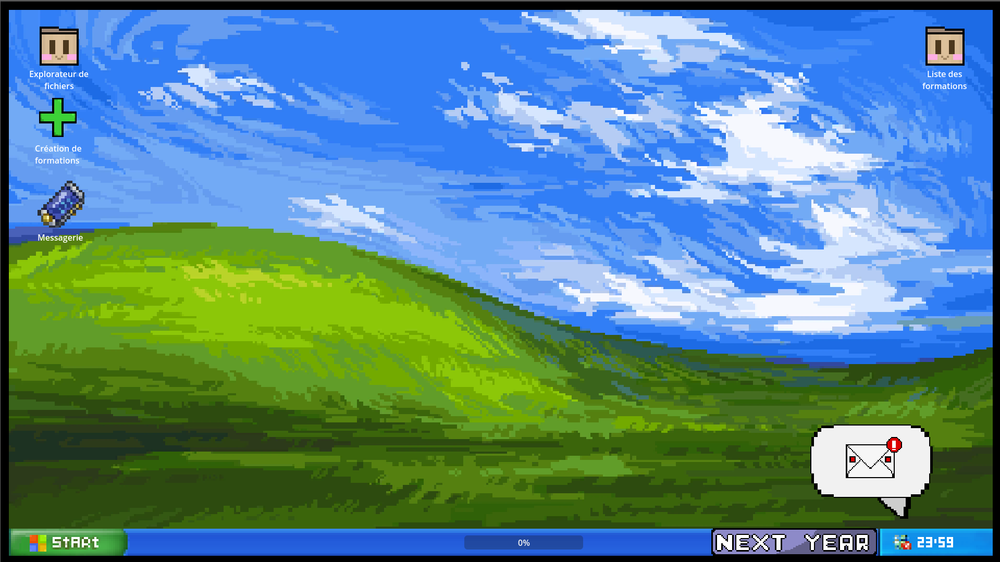
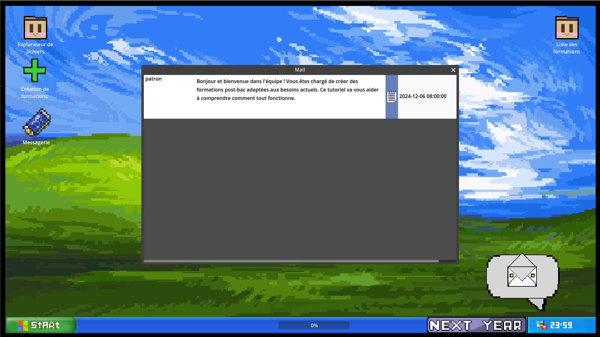
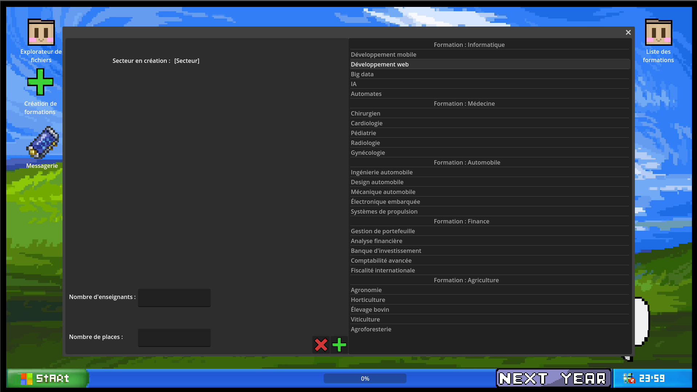
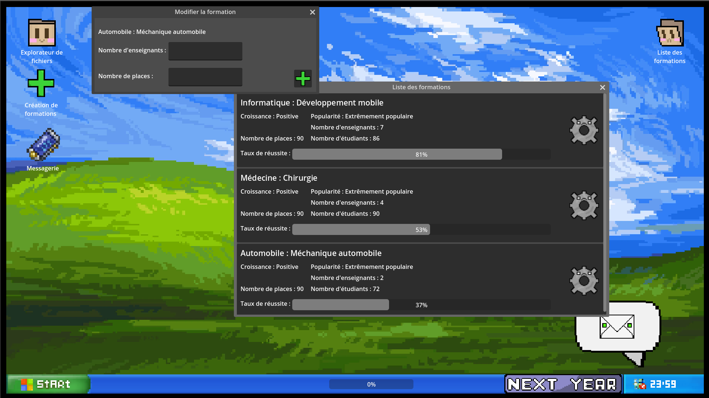

# **Projet BUT24-T4-A : 404 NAME NOT FOUND**

### **Nom du groupe : 404 NAME NOT FOUND**

**Membres du groupe :**
- Bowman Nathan  
- Simon Williams  
- Yang Vallée  
- Fahri Cetinkaya  

---

# Table of Contents

1. [Présentation du projet](#présentation-du-projet)
2. [Captures d'écran](#captures-décran)
3. [Procédures d'installation et d'exécution](#procédures-dinstallation-et-dexécution)
4. [Objectifs pédagogiques](#objectifs-pédagogiques)
5. [Références](#références)
6. [Description des fonctionnalités](#description-des-fonctionnalités)
7. [Scénarios](#scénarios)

---

## **Présentation du projet**

On a développé un jeu sérieux de gestion sur Godot 4.3 qui a pour objectif d'aider les utilisateurs à comprendre le processus de création des formations post-bac et les différentes contraintes associées.

**Notre serious game, où le joueur devra créer des formations post-bac dans divers domaines, permettra notamment de :**

- Montrer le processus lié à la création de formations par rapport au nombre d'enseignants et au nombre d'élèves.
- Enseigner les différents types de formations et les contraintes liées à chacune d'entre elles.
- Expliquer les différentes étapes de validation ou de réexamen des propositions de nouvelles formations.

Notre jeu vise à offrir une expérience immersive pour mieux saisir les défis et les responsabilités liés à la mise en place de parcours éducatifs post-bac.

---

## Captures d'écran

1. **Écran principal** :  
   

2. **Écran de Mails** :  
   

3. **Écran de choix des formations** :  
   

4. **Écran des formations créées** :  
   

---

## Procédures d'installation et d'exécution

Si vous rencontrez des soucis pour l'installer à cause de l'antivirus :
- Cliquez sur la flèche en bas à droite et allez dans "Sécurité Windows".
- Accédez à "Protection contre les virus et menaces".
- Cliquez sur "Gérer les paramètres".
- Désactivez l'antivirus temporairement.

**Attention : Pensez à le réactiver ensuite !!!**

---

## Objectifs pédagogiques

Les objectifs pédagogiques du jeu sont les suivants :

- **Comprendre la création d’une formation** :
  Une formation ne se crée pas au hasard. Plusieurs paramètres doivent être pris en compte avant de pouvoir finaliser une formation.

- **Identifier les ressources et les étapes nécessaires** :
  Il est essentiel de comprendre les étapes et les ressources requises avant de pouvoir soumettre une formation.

- **Gérer la réputation** :
  La réputation d’un établissement est un facteur important pour attirer étudiants et enseignants. Il faut travailler à maintenir une bonne réputation pour garantir le succès des formations.

---

## Références

1. [Moteur de recherche des certifications professionnelles](https://www.francecompetences.fr/recherche-resultats/)
2. [Diplôme d’université (France)](https://fr.wikipedia.org/wiki/Dipl%C3%B4me_d%27universit%C3%A9_(France))
3. [Diplôme national en France](https://fr.wikipedia.org/wiki/Dipl%C3%B4me_national_en_France)
4. [Site de l'HCERES](https://www.hceres.fr/fr)
5. [Site de la CNESER](https://www.culture.gouv.fr/Thematiques/enseignement-superieur-et-recherche/La-recherche-culturelle/Contexte-national-de-la-recherche/Le-Conseil-national-de-l-enseignement-superieur-et-de-la-recherche-Cneser)

---

## Description des fonctionnalités

### Simulation

Le jeu fonctionne avec un pas de gestion de 1 an par tour de jeu. Voici les étapes principales :

1. **Début de partie** :
   - Le jeu commence avec 3 formations déjà créées et un mail dans la boîte mail.
   - Le premier mail sert de tutoriel et explique quoi faire lorsque le jeu est lancé pour la première fois.

2. **Exploration et interactions** :
   - Différents dossiers contiennent des explications sur les interfaces graphiques disponibles.
   - Une messagerie permet de contacter des supérieurs hiérarchiques pour obtenir plus d’informations si nécessaire.

3. **Création de formations** :
   - Le joueur peut créer une formation en sélectionnant une formation demandée dans un mail.
   - Il remplit le nombre d’enseignants et d’élèves dans deux champs de saisie.
   - Le processus est finalisé en appuyant sur le bouton "+".

4. **Suivi des formations** :
   - Les formations créées sont visibles dans le dossier "Liste des formations".
   - Une barre "taux de réussite" indique leurs performances.
   - Les formations peuvent être améliorées pour augmenter leur taux de réussite.

5. **Avancement dans le jeu** :
   - Le joueur peut appuyer sur le bouton "NEXT YEAR" pour terminer l’année et passer au tour suivant.
   - S’il a créé la formation demandée, il peut avancer et créer une nouvelle formation.

### Interface principale

- Une page principale simulant un bureau Windows classique.
- Un explorateur de fichiers pour consulter des tutoriels et des explications des interfaces.
- Une messagerie pour poser des questions aux supérieurs hiérarchiques.
- Une page de mails fournissant des instructions.
- Une page de création de formation avec une liste de formations existantes et deux champs de saisie pour le nombre d’élèves et d’enseignants.
- Une page pour voir et modifier les formations existantes.

### Actions du joueur

- Quitter le jeu avec la touche Échap.
- Cliquer sur les icônes du bureau et de l’explorateur de fichiers.
- Ouvrir la messagerie pour poser des questions.
- Agrandir les mails si nécessaire.
- Sélectionner une formation existante, entrer des chiffres dans les champs de saisie pour le nombre d'élèves et d’enseignants.
- Modifier les formations existantes via un bouton rouage.
- Passer au tour suivant avec le bouton "NEXT YEAR".

---

## Scénarios

1. **Découverte** :
   - Le joueur ouvre sa boîte mail pour lire les instructions.
   - Il explore le bureau et consulte les informations disponibles.

2. **Création de formation** :
   - Il ouvre la page de création et crée sa première formation.
   - La formation créée est vérifiée dans la liste des formations.

3. **Progression** :
   - S’il a réussi la création demandée, il appuie sur "NEXT YEAR" et poursuit avec une nouvelle formation.
